# CS 7720 - Machine Learning & Pattern Recognition
## An implementation and analysis of K-Means, Fuzzy C-Means, and Possibilistic C Means
**Holt Skinner**

### Description
In the world of clustering algorithms, the K Means and Fuzzy C-Means Algorithms remain popular choices to determine clusters. The basic K Means clustering algorithm goes as follows.

```
1. Initialize K cluster centers (Random or specifically chosen from data set)
2. Place all points into the cluster of the closest prototype
3. Update memberships and cluster centers
4. Repeat until Clusters Stabilize or until a certain number of iterations.
```

The Fuzzy C-Means Algorithm improves upon K Means by allowing data points to have a membership in more than one cluster, given as a number between 0-1. All of the membership values for a particular data point must add up to one. Possibilistic C Means (PCM) is an algorithm created by Dr. Jim Keller and Raghu Krishnapuram that eliminates the probabilistic constraint that all membership values must add up to one. This allows points relatively far away from all of the clusters (outliers) to have negligible membership in all of the clusters. This is an important advantage because noise data  can be filtered out without altering the cluster centers. If the outliers were left in, it could drastically shift the cluster centers away from their true location. Despite its advantages, there is currently not an open source python library that supports the PCM algorithm. To solve this, the project will consist of an open source implementation of PCM in Python hosted on GitHub.

### Goals

#### Short-Term

- Code Implementation
- Test with Well-Known Data Set (Iris Data)
- Display Results in a Scatter Chart

#### Long-Term & Final

- Initizalize Clusters with K-Means and Fuzzy C-Means output.
- Run PCM on NFL Play Data.

### Benefits / Expected Outcomes

The ultimate goal for the project is to create a working implementation of the Possibilistic C-Means and Fuzzy C-Means Algorithms that can be generalized for a multitude of use cases. This implementation will be released to Github to allow it for use by Data Scientists and Machine Learning Specialists, as well as a comparison point for my Senior Capstone Project that compares Machine Learning Models for predicting the outcomes of NFL Games.

### Algorithm

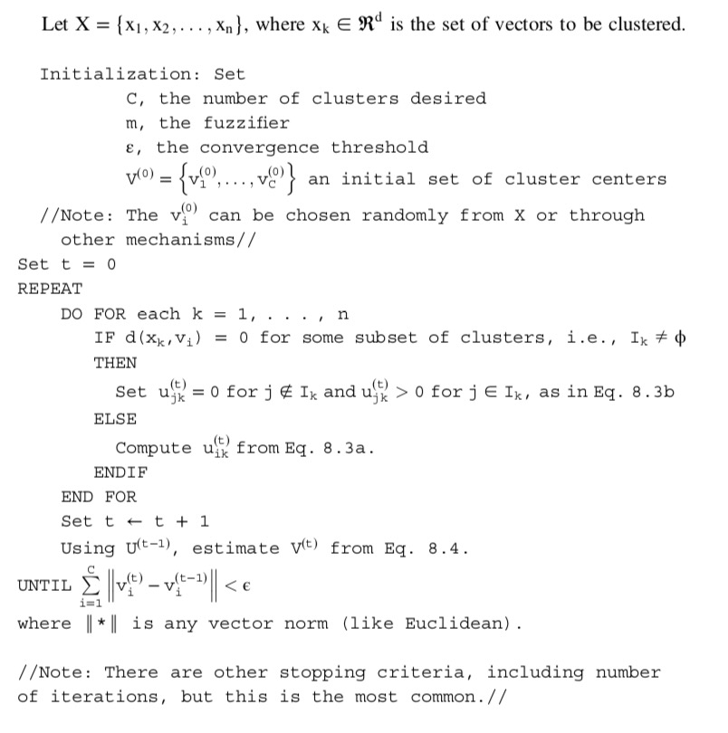

Where:

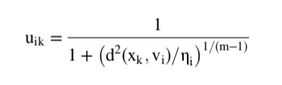

and 

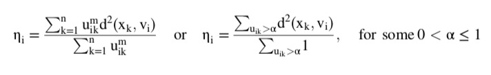

Calculated with the results from Fuzzy C-Means or set equal to 1

Source: Keller, Fundamentals of Computational Intelligence

### Libraries Utilized

- [Numpy](numpy.org)
    - Scientific Computing Python Library
    - Contains Data Structures and Algorithms for mathematical operations

- [Scipy](scipy.org)
    - Scientific computing Python Library (Used in conjunction with numpy)
    - Contains Distance Calulation Algorithm used in Fuzzy and Possibilistic C Means
    - Supports different measures for distance including Euclidean and Mahalanobis

- [Matplotlib](matplotlib.org)
    - Python Library for plotting graphs and charts

- [Scikit Learn](scikit-learn.org)
    - Python Library with preloaded datasets
    - Use for comparison and testing.

- [Scikit Fuzzy](pythonhosted.org/scikit-fuzzy/)
    - Python Library containing the Fuzzy C Means Algorithm as well as other fuzzy logic operations

### Validation and Testing

One of the challenges of testing clustering algorithms is the fact that it is unsupervised, and it doesn't find explicit classes. Even if there is labeled data to test on, the labels don't neccesarily line up with the clusters even with a perfect grouping becuase clustering doesn't take labels into account. Instead of matching labels, one of the most effective testing strategies is computing the distances of each point to its cluster center and summing up the results. For testing with the labeled data, I ran the validity measure once with the actual mean values if the data was clustered perfectly by class and once with the membership values calculated by the clustering algorithms. These values were then put into a ratio of clustered distances over class distances.

For each run of Possibilistic C Means, the data was first run through the Fuzzy C Means algorithm to obtain reasonable initial cluster centers, and them the data is run through PCM with the cluster centers obtained from FCM.

### Datasets

During development of the algorithms, random multi-dimensional gaussian "blobs" were generated with the scikit learn function `make_blobs`. After using matplotlib functions to graph the clusters and the centers (using different colors to differentiate), the following graphs were produced with random initializations of cluster numbers, features, sample sizes. The data is graphed using a projection of all features into two dimensions using PCA for ease of reading.

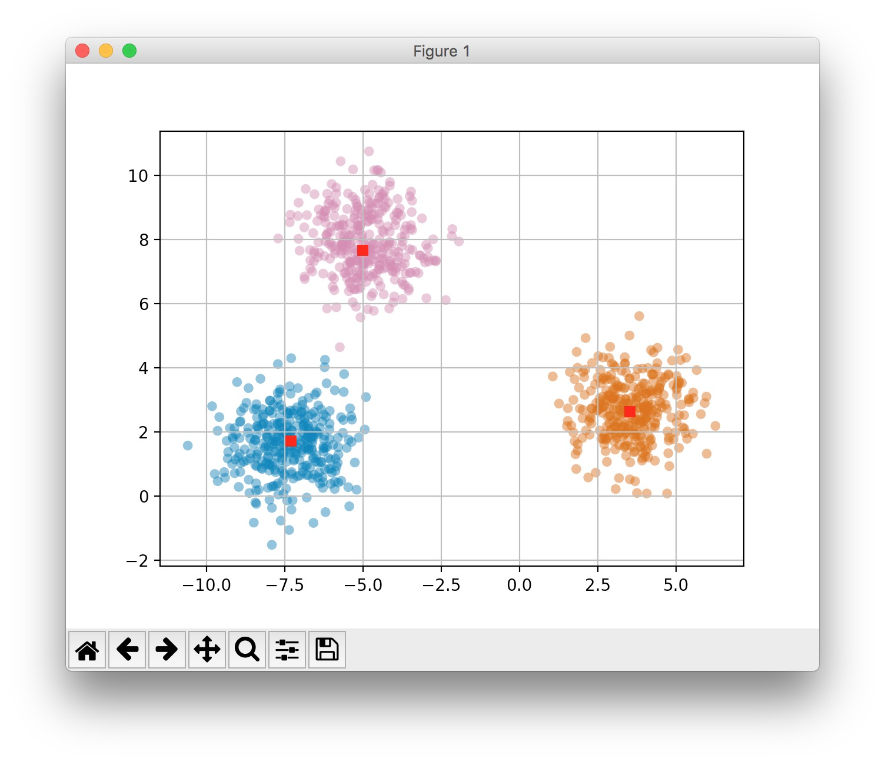
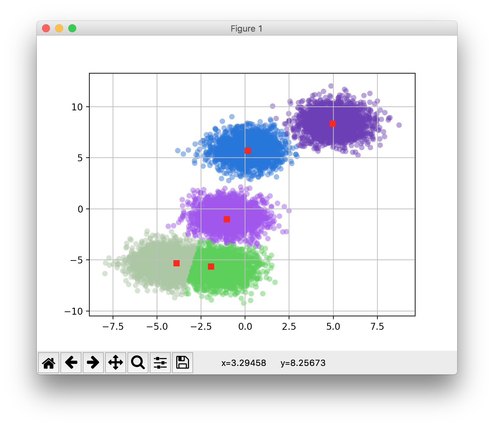
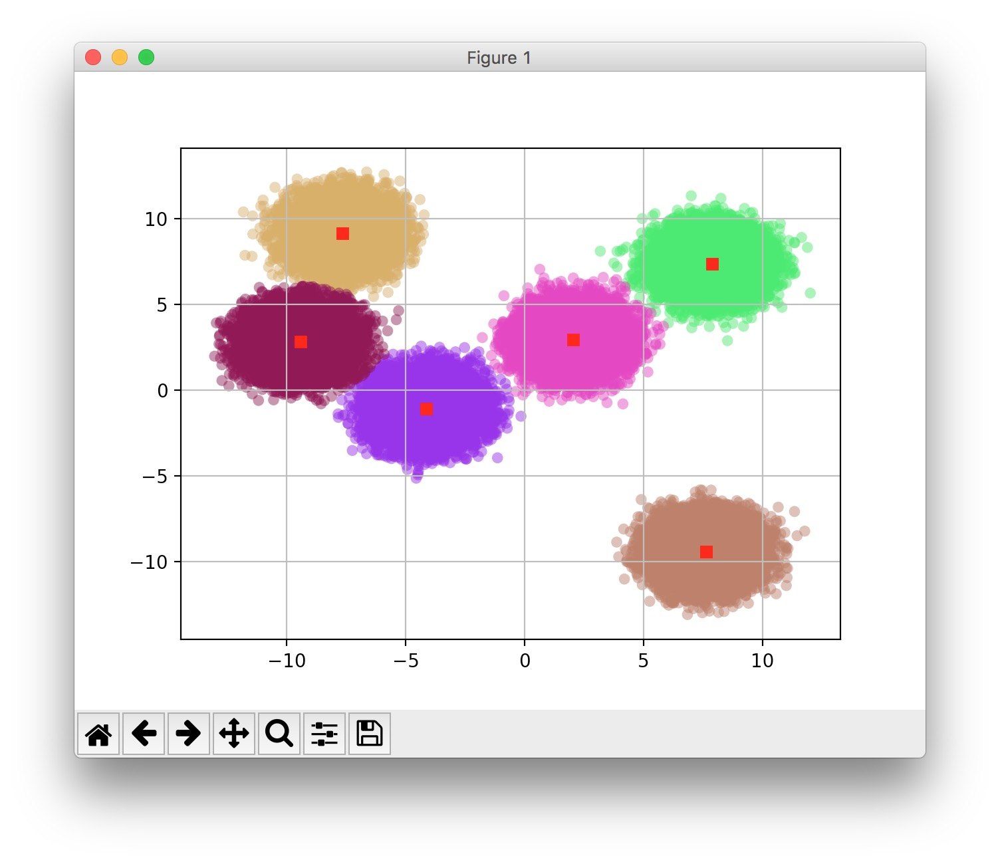
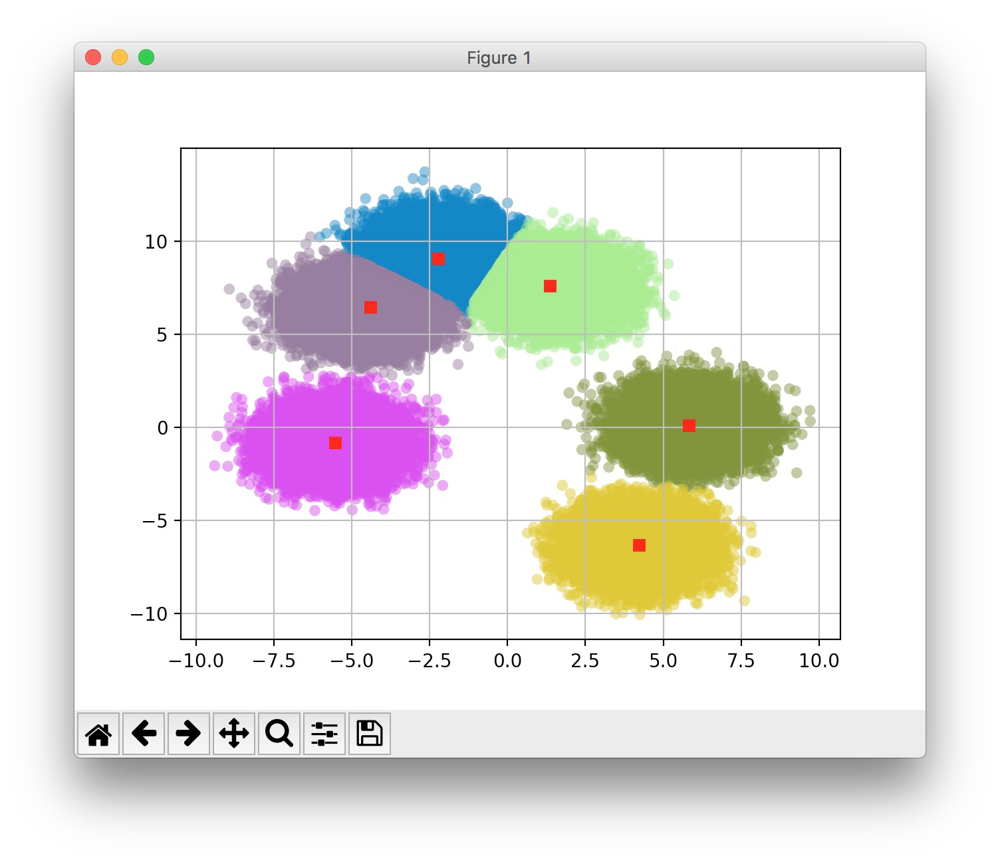
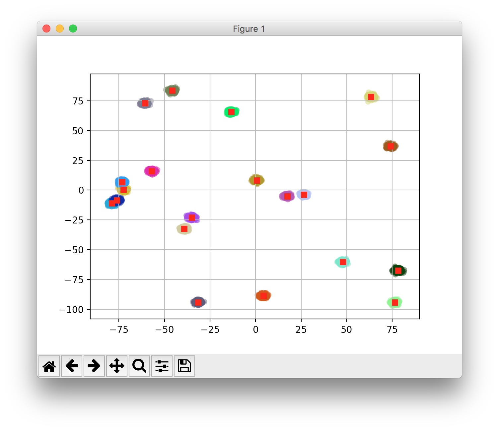

This particular cluster set worked quite well on the validity measure, getting a distance ratio of 1.0000005, which means clustering provided slightly better mean values than the classes themselves; however, this also could have been a minor floating point error with numpy. The average distance ratio was .98 because the gaussian blobs are the absolute best case scenario for clustering algorithms and are not representative of real datasets. They are purely used to make sure the algorithm works as expected.

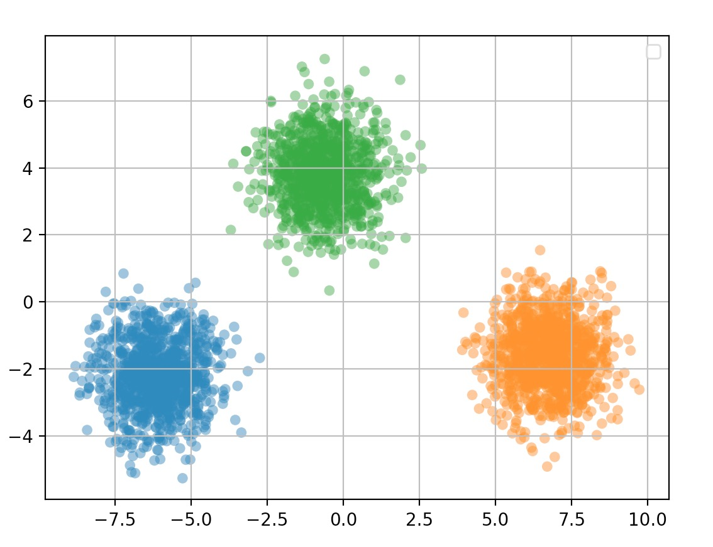

[https://en.wikipedia.org/wiki/Iris_flower_data_set](https://en.wikipedia.org/wiki/Iris_flower_data_set)

For additional validation and testing, the Iris flower data set as collected by Ronald Fisher was used, as it is easily available in the scikit learn library and the proper classiciation is already known. The Data was run through both the Project Built PCM and FCM as well as the Fuzzy C-Means as available in the Scikit-fuzzy Open Source Python Library. Since the data has been filtered for noise points, both algorithms provided similar results. The labels in the data itself were used as a validation measure by calculating the percentage correctly identified based on the target labels. The FCM and PCM together averaged 92% accuracy when compared to the labels. This dataset was small enough that the data could be sorted by labels and compared to the clustering results in a 1 to 1 correspondance. The especially challenging parts to differentiate were between the versicolor and virignica species because thedata is very close in certain dimensionality. This plot is based on two of the four features in the data set that are easiest to dicern visually.

This dataset had an average distance ratio of .9677 

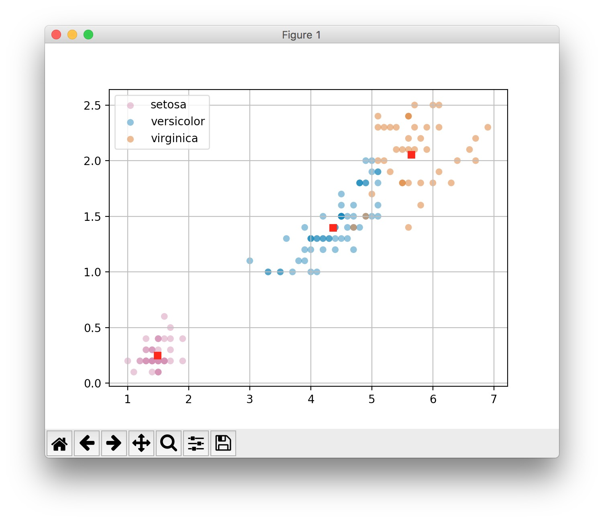 

Another dataset utilized is the Optical Recognition of Handwritten Digits Data Set from the UCI ML Library. This dataset consists of handwritten numeric digits from 0-9 consisting of 5620 samples with 64 features. Each is an 8x8 image. The graph produced does not provide much insight because the features are difficult to project in 2D or even 3D space.

This dataset had an average distance ratio of 1.119; however, this high of a value above 1 suggests that some points would be classified incorrectly if this algorithm was used as a classifier. It means that many of the digits were misshapen enough that the clustering grouped them with a different number that was closer in euclidean space than to the actual value.

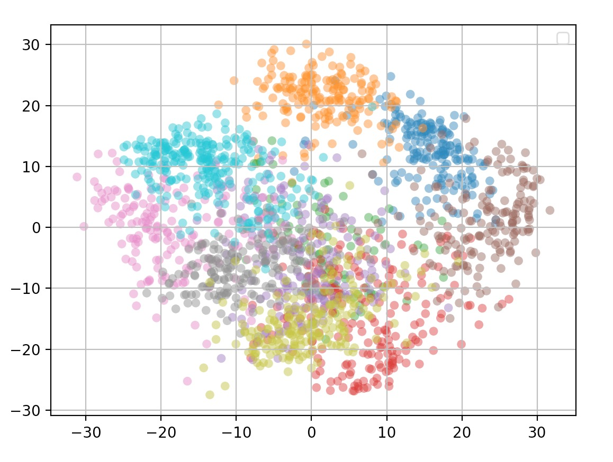

### Analysis

#### Efficiency

This implementation has allowed a great expansion of knowledge about not only the logic behind clustering, but also the intricacies of the python language and specifically the numpy library. The implementation lent itself not only to correctness, but efficiency for large datasets. Many of the matrix computations proved challenging to compute. The first attempt consisted of a lot of nested for loops. While easier to visualize, they proved to be very slow once the dataset got above 100 elements and 2 dimensions. The calculations took almost a minute for each dataset. After consulting with experts (StackOverflow), a much more efficient solution was found in the form of the numpy library. Numpy creates python stub calls that link to compiled code in C or C++, which allows much more high performance programming. The most useful element is the numpy array, which is a wrapper for a C array allowing constant lookup time. In Python, Lists are the primary data structure which are made using hashmaps behind the scenes. The extra hash step in the structure greatly slowed down the performance. In its final form, the program takes 1 second to generate the random data and run the algorithm on 100,000 samples in 4 feature space.

#### Poking and Prying

The primary downside of clustering is its stability and consistency. This si especially noted in PCM versus FCM. PCM is much more sensitive to random initialization of cluster centers and to the value of the fuzzifier constant. For all of the images above, the data was run through FCM before hitting the PCM and the fuzzifier was kept at 1.2, as it provided the most accurate results for these datasets. One issue that arose when running PCM on its own was collision of the cluster centers. If any of the initial cluster centers happened to be close to each other, the PCM would have issues moving one of the centers to another part of the data space. This resulted in charts similar to the one below. The cluster center on the left is actually 3 cluster centers with neglibible distance between them. Runnign FCM before PCM resolves this by providing better starting points rather than random initialization. This bug was a major block in production for a part of the project because the results would be wildly inconsistent between tests.

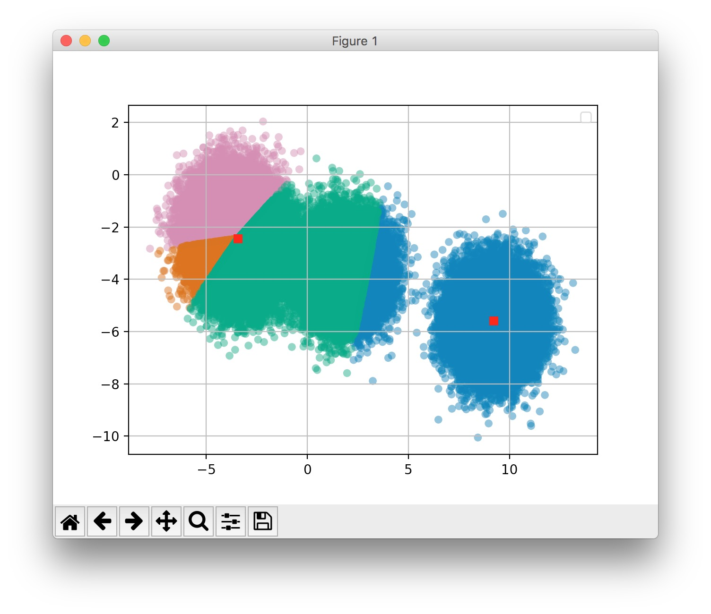

One of the original goals for the project was to allow the Clustering Algorithms to be run with multiple different types of distance metrics (Euclidean, Mahalanobis, etc.) This proved very simple to implement, because the `cdist` function from scipy allows the input of many different types of metrics. The FCM and PCM functions allow the user to input any of the measures accepted by this function into the cluster algorithm. At first glance, this extra feature did not prove as useful as originally hoped. When attempted with Mahalanobis distance, many of the clusters did not form as expected as shown in the image below. However, this did prove useful as the number of features increased beyond 2, as the clusters formed as expected in higher dimension space.

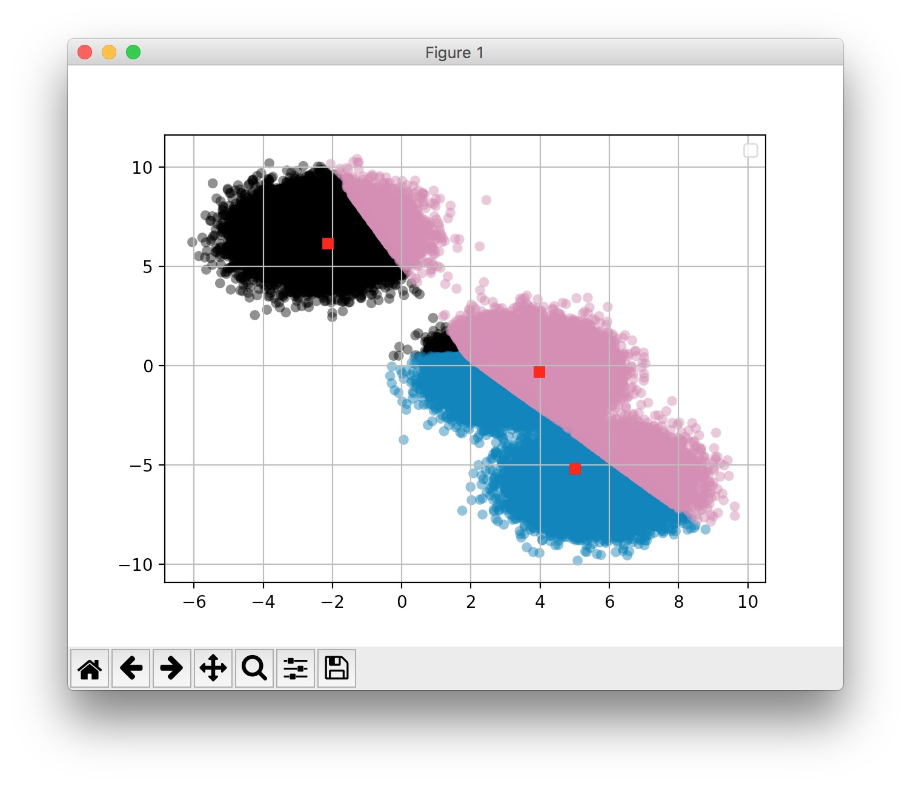

### NFL Clustering

A further application of this implementation is for my Senior Capstone team project (with Alex Hurt and Payton Hosna) which seeks to group NFL teams based on playing styles and use the results to predict the outcome of games. This data is ideal for clustering because there are no explicit labels for classes and the ultimate goal is to find similar groups in the dataset. The data was sourced from [Kaggle](https://www.kaggle.com/maxhorowitz/nflplaybyplay2009to2016)

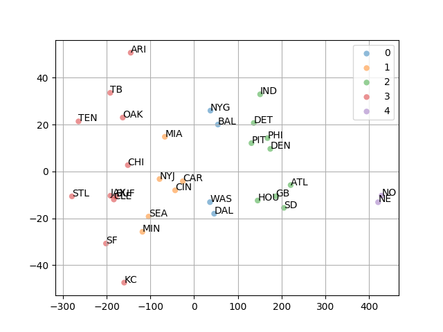

The clustering results were aggregated by Alex Hurt and each cluster was compared against the others by game winner. The numbers in each circle are the likelihood of a cluster winning against all other clusters. The outcome proved that the clustering was 63.33% accurate at predicting the winner. The other Machine Learning Model chosen was a MultiLayer Perceptron, which provided an accuracy of 60.42%, 3 percent less than clustering.

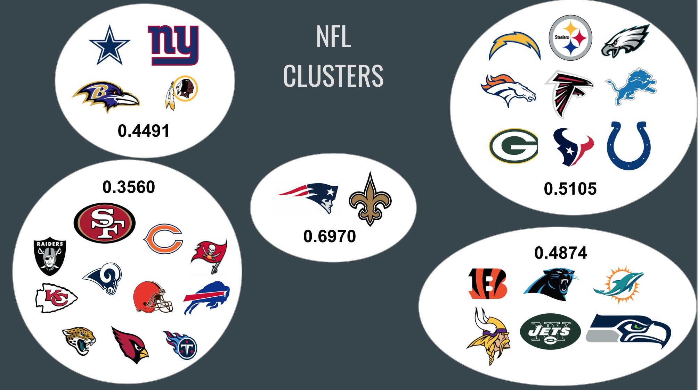

#### Further Work

To continue working on the implementation, an ultimate goal is to add a PCM implementation and an improvement to FCM to the scikit fuzzy open source library. The library is currently on GitHub and is accepting pull requests. A next step is to make a clone of the scikit fuzzy library and make modifications to add PCM to the FCM module. In my implementation, I have set up the parameters similar to the existing library to allow for an easier transition. The implementation also uses functional programming concepts to allow the criterion function to be sent as a parameter to the clustering algorithm, since it is the primary differentiator between K Means, Fuzzy C Means and Possibilistic C Means.

## Code

**Repository:** [https://github.com/holtwashere/PossibilisticCMeans]()

`cmeans.py`
```python

import numpy as np
from scipy.spatial.distance import cdist


def _eta(u, d, m):

    u = u ** m
    n = np.sum(u * d, axis=1) / np.sum(u, axis=1)

    return n


def _update_clusters(x, u, m):
    um = u ** m
    v = um.dot(x.T) / np.atleast_2d(um.sum(axis=1)).T
    return v


def _hcm_criterion(x, v, n, m, metric):

    d = cdist(x.T, v, metric=metric)

    y = np.argmin(d, axis=1)

    u = np.zeros((v.shape[0], x.shape[1]))

    for i in range(x.shape[1]):
        u[y[i]][i] = 1

    return u, d


def _fcm_criterion(x, v, n, m, metric):

    d = cdist(x.T, v, metric=metric).T

    # Sanitize Distances (Avoid Zeroes)
    d = np.fmax(d, np.finfo(x.dtype).eps)

    exp = -2. / (m - 1)
    d2 = d ** exp

    u = d2 / np.sum(d2, axis=0, keepdims=1)

    return u, d


def _pcm_criterion(x, v, n, m, metric):

    d = cdist(x.T, v, metric=metric)
    d = np.fmax(d, np.finfo(x.dtype).eps)

    d2 = (d ** 2) / n
    exp = 1. / (m - 1)
    d2 = d2.T ** exp
    u = 1. / (1. + d2)

    return u, d


def _cmeans(x, c, m, e, max_iterations, criterion_function, metric="euclidean", v0=None, n=None):

    if not x.any() or len(x) < 1 or len(x[0]) < 1:
        print("Error: Data is in incorrect format")
        return

    # Num Features, Datapoints
    S, N = x.shape

    if not c or c <= 0:
        print("Error: Number of clusters must be at least 1")

    if not m:
        print("Error: Fuzzifier must be greater than 1")
        return

    # Initialize the cluster centers
    # If the user doesn't provide their own starting points,
    if v0 is None:
        # Pick random values from dataset
        xt = x.T
        v0 = xt[np.random.choice(xt.shape[0], c, replace=False), :]

    # List of all cluster centers (Bookkeeping)
    v = np.empty((max_iterations, c, S))
    v[0] = np.array(v0)

    # Membership Matrix Each Data Point in eah cluster
    u = np.zeros((max_iterations, c, N))

    # Number of Iterations
    t = 0

    while t < max_iterations - 1:

        u[t], d = criterion_function(x, v[t], n, m, metric)
        v[t + 1] = _update_clusters(x, u[t], m)

        # Stopping Criteria
        if np.linalg.norm(v[t + 1] - v[t]) < e:
            break

        t += 1

    return v[t], v[0], u[t - 1], u[0], d, t


# Public Facing Functions
def hcm(x, c, e, max_iterations, metric="euclidean", v0=None):
    return _cmeans(x, c, 1, e, max_iterations, _hcm_criterion, metric, v0=v0)


def fcm(x, c, m, e, max_iterations, metric="euclidean", v0=None):

    return _cmeans(x, c, m, e, max_iterations, _fcm_criterion, metric, v0=v0)


def pcm(x, c, m, e, max_iterations, metric="euclidean", v0=None):
    """

    Parameters
    ---

    `x` 2D array, size (S, N)
        Data to be clustered. N is the number of data sets;
        S is the number of features within each sample vector.

    `c` int
        Number of clusters

    `m` float, optional
        Fuzzifier

    `e` float, optional
        Convergence threshold

    `max_iterations` int, optional
        Maximum number of iterations

    `v0` array-like, optional
        Initial cluster centers

    Returns
    ---

    `v` 2D Array, size (S, c)
        Cluster centers

    `v0` 2D Array (S, c)
        Inital Cluster Centers

    `u` 2D Array (S, N)
        Final partitioned matrix

    `u0` 2D Array (S, N)
        Initial partition matrix

    `d` 2D Array (S, N)
        Distance Matrix

    `t` int
        Number of iterations run

    """

    v, v0, u, u0, d, t = fcm(x, c, m, e, max_iterations, metric=metric, v0=v0)
    n = _eta(u, d, m)
    return _cmeans(x, c, m, e, t, _pcm_criterion, metric, v0=v, n=n)
```

`plot.py`

```python
import numpy as np
from matplotlib import pyplot as plt
from sklearn.decomposition import PCA


def plot(x, v, u, c, labels=None):

    ax = plt.subplots()[1]

    # Plot assigned clusters, for each data point in training set
    cluster_membership = np.argmax(u, axis=0)

    x = PCA(n_components=2).fit_transform(x).T

    for j in range(c):
        ax.scatter(
            x[0][cluster_membership == j],
            x[1][cluster_membership == j],
            alpha=0.5,
            edgecolors="none")

    ax.legend()
    ax.grid(True)
    plt.show()
```

`main.py`

```python

import numpy as np
import sklearn as sk
import sklearn.datasets as ds
import skfuzzy as fuzz
from plot import plot
import cmeans


def generate_data(num_samples, num_features, c, shuffle=True):

    x = ds.make_blobs(num_samples, num_features, c, shuffle=False)[0]

    x = x.T

    labels = np.zeros(num_samples)

    j = int(num_samples / c)

    for i in range(c):
        p = i * j
        q = (i + 1) * j
        print()
        labels[p:q] = i

    return x, labels


def verify_clusters(x, c, v, u, labels):

    ssd_actual = 0

    for i in range(c):
        # All points in class
        x1 = x[labels == i]
        # Mean of class
        m = np.mean(x1, axis=0)

        for pt in x1:
            ssd_actual += np.linalg.norm(pt - m)

    clm = np.argmax(u, axis=0)
    ssd_clusters = 0

    for i in range(c):
        # Points clustered in a class
        x2 = x[clm == i]

        for pt in x2:
            ssd_clusters += np.linalg.norm(pt - v[i])

    print(ssd_clusters / ssd_actual)


num_samples = 3000
num_features = 2
c = 3
fuzzifier = 1.2
error = 0.001
maxiter = 100

# np.random.seed(100)

x, labels = generate_data(num_samples, num_features, c, shuffle=False)

v, v0, u, u0, d, t = cmeans.fcm(x, c, fuzzifier, error, maxiter)

plot(x.T, v, u, c)

print("Blobs")
verify_clusters(x.T, c, v, u, labels)

iris = ds.load_iris()

labels = iris.target_names
target = iris.target
iris = np.array(iris.data).T

c = 3

v, v0, u, u0, d, t = cmeans.fcm(iris, c, fuzzifier, error, maxiter)
iris = iris.T

print("Iris")

verify_clusters(iris, c, v, u, target)


digits = ds.load_digits()

labels = digits.target

digits = np.array(digits.data).T

c = 10

v, v0, u, u0, d, t = cmeans.pcm(digits, c, fuzzifier, error, maxiter)

print("Digits")
verify_clusters(digits.T, c, v, u, labels)
plot(digits.T, v, u, c)
```
